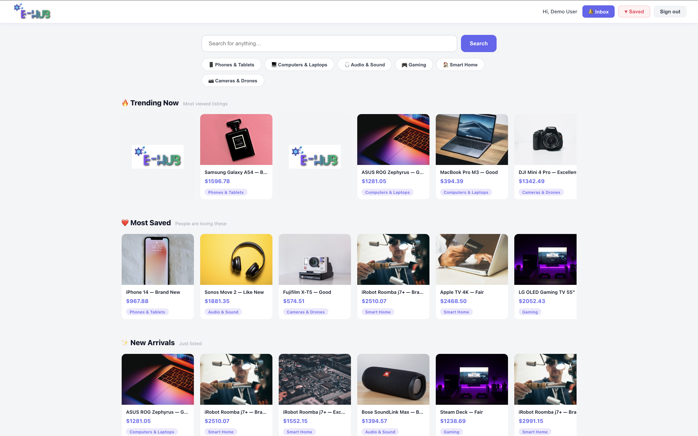
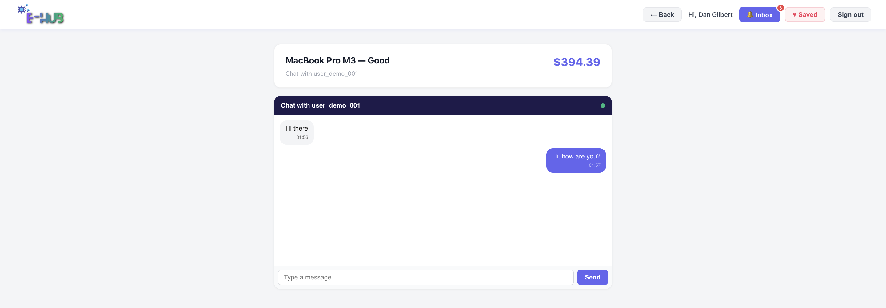
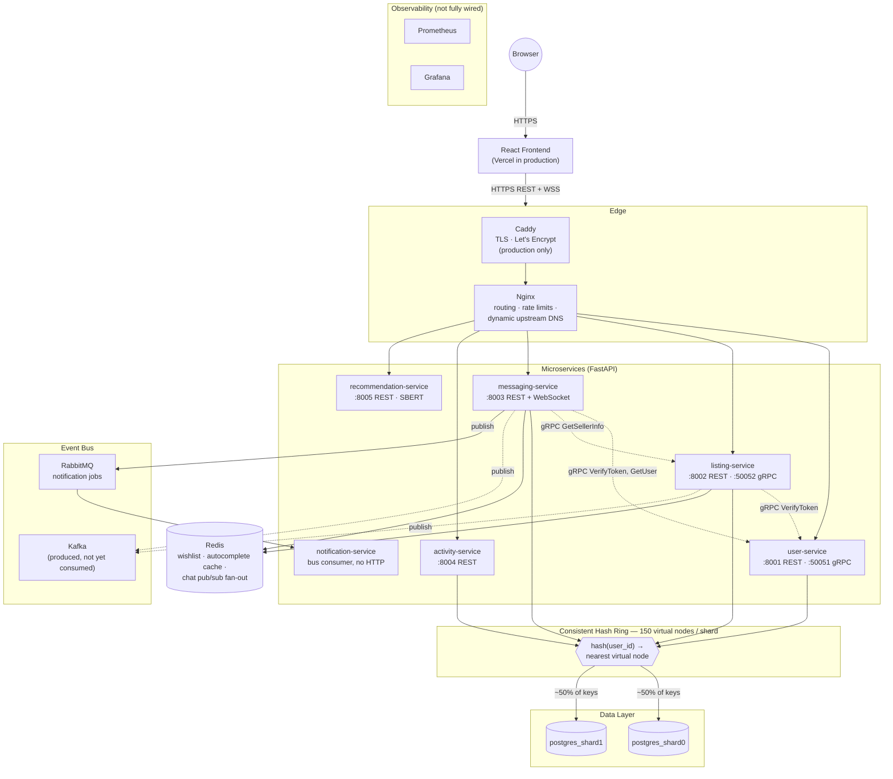
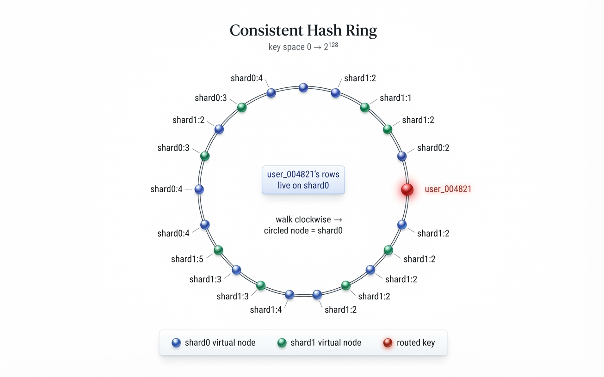
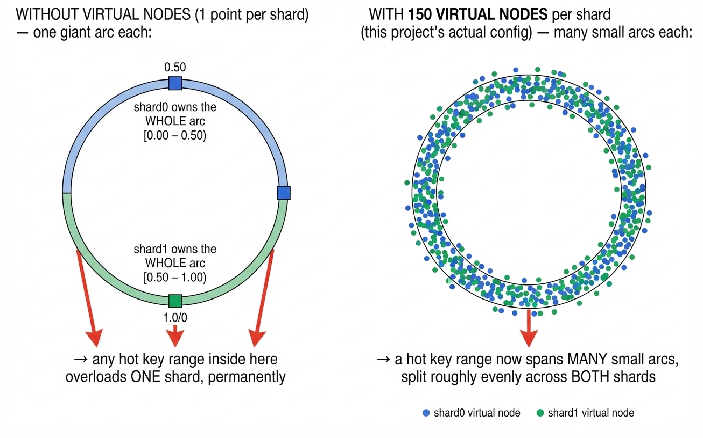
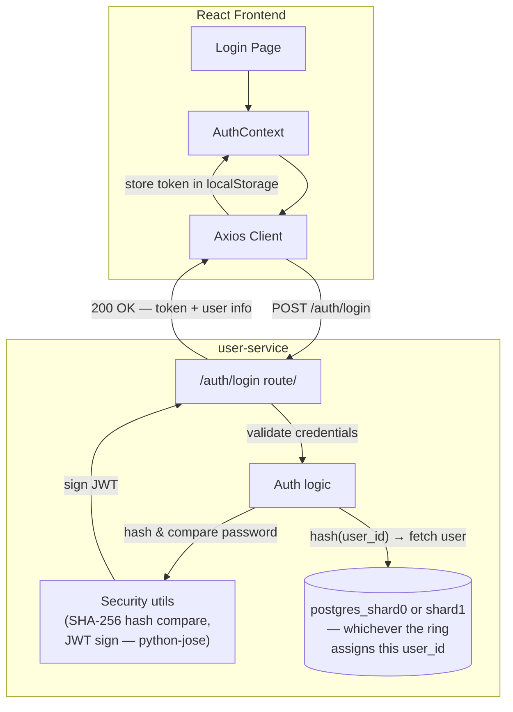
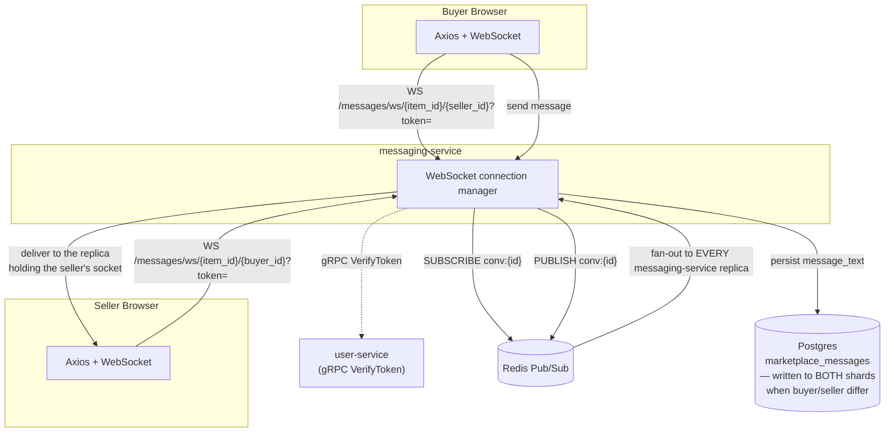
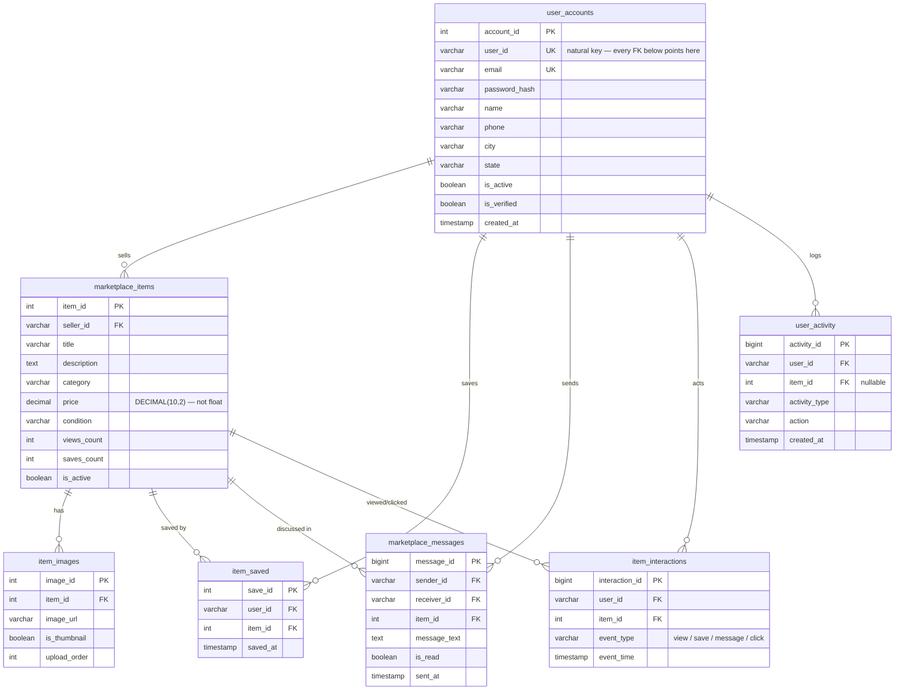

<div align="center">
  

  <h1>ElectroHub</h1>
  <p>A full-stack electronics marketplace built on microservices — buy, sell, chat, and discover products in real time.</p>

  <p>
    
    
    
    
    
    
    
  </p>

  <p>
    <a href="https://electrohub-rose.vercel.app"><strong>🚀 Live Demo</strong></a> ·
    <a href="https://electrohub-rose.vercel.app/login">Login page</a>
  </p>
</div>

> **🔑 Try it now:** [electrohub-rose.vercel.app](https://electrohub-rose.vercel.app) — log in with `demo@electrohub.com` / `password123` to browse real seeded listings, chat, and see recommendations live. (Frontend on Vercel, backend on a Google Cloud VM behind HTTPS — see [`SYSTEM_DESIGN_AND_DEPLOYMENT.md`](SYSTEM_DESIGN_AND_DEPLOYMENT.md) for the full deployment story.)

## 📖 Introduction

ElectroHub is a peer-to-peer marketplace for electronics. Users list items, buyers browse and filter by category, message sellers directly, save items to a wishlist, get instant autocomplete suggestions, and get AI-powered recommendations based on what they're viewing.

Everything runs locally in Docker — one `docker compose up` brings up the full 14-container stack, including sharded database seeding and an automated 18-point verification of the sharding itself.

---

## ✨ Features

- 🔍 **Browse & Search** — filter by category, keyword search, trending / most-saved / new-arrivals sections
- ⚡ **Autocomplete** — a Trie (prefix tree) ranks suggestions by popularity, with a Redis cache in front of it for hot prefixes
- 💬 **Real-time Chat** — WebSocket messaging between buyers and sellers, per-conversation threads, delivered via Redis Pub/Sub fan-out so it works across multiple service replicas
- ❤️ **Wishlist** — save items with a heart button; backed by Redis for instant reads with PostgreSQL persistence
- 🤖 **AI Recommendations** — SBERT (`all-MiniLM-L6-v2`) semantic similarity; "Similar Listings" shown on every item page
- 🎯 **Sharded Data Layer** — every table is split across **two PostgreSQL shards** using a real consistent-hashing ring with **150 virtual nodes per shard** — see the [dedicated section](#-consistent-hashing--why-two-shards-dont-mean-double-the-headaches) below, with an actual ring diagram
- 🔔 **Notification Bell** — live unread message count in the navbar, polls every 30 seconds
- 🔒 **JWT Auth** — token stored in localStorage, injected into every API call via an Axios interceptor, verified centrally by `user-service` over gRPC

---

## 🖼️ Website

<table>
  <tr>
    <td width="55%">
      
    </td>
    <td width="45%" valign="middle" style="padding-left:24px">
      <h3>Browse & Discover</h3>
      <p>
        The home page surfaces three personalised rows — <strong>Trending Now</strong> (most viewed),
        <strong>Most Saved</strong>, and <strong>New Arrivals</strong> — pulled from a live pool of
        listings. Category pills and a search bar let buyers drill down instantly.
        Navigation between pages is instant thanks to a 5-minute client-side cache.
      </p>
    </td>
  </tr>

  <tr>
    <td width="45%" valign="middle" style="padding-right:24px">
      <h3>Item Detail & AI Recommendations</h3>
      <p>
        Every listing shows full images, condition, location, and live save count.
        Buyers can message the seller directly or save the item to their wishlist with one click.
        Below the listing, <strong>Similar Listings</strong> are generated in real time using
        SBERT semantic embeddings — not just category matching.
      </p>
    </td>
    <td width="55%">
      
    </td>
  </tr>

  <tr>
    <td width="55%">
      
    </td>
    <td width="45%" valign="middle" style="padding-left:24px">
      <h3>Real-time Inbox & Chat</h3>
      <p>
        Messages are grouped into conversation threads per listing.
        The notification bell in the navbar shows a live unread count.
        Under the hood, each chat session is a WebSocket connection backed by
        Redis Pub/Sub — so both buyer and seller receive messages instantly
        without polling, even when connected to different service replicas.
      </p>
    </td>
  </tr>

  <tr>
    <td width="45%" valign="middle" style="padding-right:24px">
      <h3>Wishlist</h3>
      <p>
        Saved items are stored in a Redis <code>SET</code> per user for O(1) reads,
        with every save also written to Postgres for durability.
        The wishlist page shows all saved listings in a grid with a one-click
        remove button. If Redis restarts, the cache is automatically rebuilt
        from the database on the next request.
      </p>
    </td>
    <td width="55%">
      
    </td>
  </tr>
</table>

---

## 🧩 Technology Stack — topic by topic

### 🔧 Backend framework
**FastAPI** (Python), 6 independent services. Chosen for native `async` support — the WebSocket chat and every DB/gRPC call are I/O-bound, and async means one process handles many of them concurrently without threads.

### 🔗 Inter-service communication
**gRPC + Protocol Buffers** (`protos/*.proto`) for internal calls only — never exposed to the frontend:
- `listing-service` and `messaging-service` → `user-service.VerifyToken` (every protected endpoint delegates JWT verification here — the signing secret lives in exactly one service)
- `messaging-service` → `listing-service.GetSellerInfo` / `GetListing` (who owns this item, before writing a "contact seller" message)

Each `Dockerfile` compiles its own stubs from the shared `.proto` files at build time — nothing generated is checked into git.

### 🐘 Data storage & sharding
**PostgreSQL 15 — two independent instances**, not one: `postgres_shard0` and `postgres_shard1`. Every table is split between them by a hand-built **consistent-hashing ring keyed on `user_id`**, not `id % 2`. Full explanation and an actual ring diagram [below](#-consistent-hashing--why-two-shards-dont-mean-double-the-headaches).

### 🔴 Caching — Redis 7
Three distinct jobs, all in front of Postgres as the source of truth:
| Use | Mechanism |
|---|---|
| ❤️ Wishlist | `SADD wishlist:{user_id}` — O(1) reads, rebuilt from Postgres on a cold cache |
| ⚡ Autocomplete | `SETEX autocomplete:{prefix}` (5 min TTL) — fast path in front of the Trie |
| 💬 Chat fan-out | `PUBLISH`/`SUBSCRIBE` per conversation — see [Real-time Chat Flow](#-real-time-chat-flow) |

### 📨 Event streaming & 🐰 messaging — two different tools, two different jobs
- **Kafka 3.7** (the `apache/kafka` image, deliberately not Confluent's — historically amd64-only, which would break ARM deploys). `listing-service` and `messaging-service` **produce** events (`item.viewed`, `item.saved`, `message.sent`, `user.login`) meant to feed an analytics pipeline. ⚠️ **Honest gap:** nothing consumes these topics yet — they're produced and currently go nowhere.
- **RabbitMQ 3** — a genuine job queue: `messaging-service` publishes a notification job when a buyer contacts a seller, `notification-service` consumes it and sends an email (or logs it, with `SMTP_*` unset). Competing-consumer, ack/retry semantics — the right tool for "deliver this job exactly once," where Kafka is right for "many independent readers might each want a copy of this stream."

### 🌐 Gateway — two reverse proxies, deliberately
- **Nginx** (internal) — routes each path prefix to its owning service, applies per-route rate limits, and hard-blocks `/docs`, `/redoc`, `/openapi.json`, `/debug*`, `/metrics` from ever reaching the internet. Every `proxy_pass` target is resolved **dynamically** through Docker's DNS on each request (not cached at Nginx startup) — so a redeployed service is reachable again within seconds instead of needing an Nginx restart.
- **Caddy 2** (production only) — terminates TLS, gets its certificate automatically from Let's Encrypt, then hands off to Nginx. Two proxies because they solve different problems: Caddy's whole job is effortless ACME/TLS, Nginx's is routing and rate limiting.

### 🔍 Search
A **Trie** (prefix tree, `services/shared/trie.py`) makes `GET /marketplace/autocomplete?q=<prefix>` an O(prefix length) walk instead of a table scan — each node keeps its own top-10 by `views_count`, maintained at insert time. The Redis cache above sits in front of it as the hot path.

### ⚛️ Frontend
**React** (Create React App), talking to the backend purely over HTTP(S)/WSS via Axios. The API base URL is injected at **build time** via `REACT_APP_API_URL` — CRA inlines it into the bundle, so changing environments needs a rebuild, not just a restart.

### 🔒 Security
JWT (HS256, `python-jose`) issued once by `user-service`, verified centrally by the same service for everyone else over gRPC. No wildcard CORS anywhere; `CORS_ORIGINS` explicitly enumerates the real frontend origin. Password hashing is currently **unsalted SHA-256** — fine for seeded demo accounts, called out here rather than glossed over, and the first thing to fix before accepting real signups.

### 🐳 Containerization & deployment
Docker + Docker Compose — one `docker-compose.yml` (14 services) + a `docker-compose.prod.yml` overlay (adds Caddy, hardens memory limits). See `DEPLOY_PLAN.md`, `CI_CD_PIPELINE.md`, and `SYSTEM_DESIGN_AND_DEPLOYMENT.md` for the full production deployment story, including three real infrastructure bugs hit and fixed on a live cloud deploy.

### 📊 Observability
Prometheus + Grafana are running but **not fully wired** — no service currently instruments its `/metrics` endpoint, so every Prometheus target shows `DOWN`. Kept as a placeholder, documented honestly rather than presented as finished.

---

## 🗺️ Architecture Diagram



**Legend:** solid arrow = HTTP/WS traffic · dashed arrow = internal gRPC call or async publish · diamond = consistent-hash routing decision · cylinder = a database · Kafka is produced-to but not yet consumed; Prometheus/Grafana run but aren't wired to real metrics yet.

---

## 🎯 Consistent Hashing — why two shards don't mean double the headaches

This is the core system-design decision in the project, so it gets its own diagram instead of a paragraph of prose.

### The problem with the obvious approach

The naive way to split data across 2 databases is `shard = hash(user_id) % 2`. It works — until you need a 3rd shard. Changing `N` from 2 to 3 changes almost **every** key's `% N` result, meaning ~100% of your data has to move at once just to add capacity.

### The ring, drawn out



`hash("user_004821")` lands at a point on the ring between two virtual nodes. Walking **clockwise** from that point, the first node reached owns the key — here, a `shard0` virtual node (circled), so `user_004821`'s rows live on shard0.

**Adding a shard later:** only the keys between that new shard's virtual nodes and each one's *previous* clockwise neighbor move. Every other key's nearest clockwise node is unchanged — verified live: **34.4% of keys moved** for a 2→3 shard split (ideal: 33.3%), **100% of them to the new shard, 0% shuffled between the two existing shards**.

### Why 150 virtual nodes per shard, not 1

One point per physical shard means each shard owns exactly one giant, arbitrary arc of the ring — every key in that huge range hits the same shard, so one hot arc = one permanently hot shard, with no way to spread that load:



**Measured, not assumed** — hashing 100,000 synthetic keys through `backend/app/core/consistent_hash.py`:

| Virtual nodes per shard | Deviation from a perfect 50/50 split |
|---|---|
| 1 (naive) | **38.62%** |
| **150 (this project)** | **0.49%** — a ~79x tighter spread |

### The code behind the diagram

```python
# backend/app/core/consistent_hash.py
class ConsistentHashRing:
    def __init__(self, replicas: int = 150):        # the "virtual nodes per shard" knob
        ...
    def add_node(self, node: str) -> None:            # places 150 points per physical shard
        for i in range(self.replicas):
            h = self._hash(f"{node}:{i}")             # e.g. MD5("shard0:0"), MD5("shard0:1"), ...
            self._ring[h] = node

    def get_node(self, key: str) -> str:               # the routing decision itself
        h = self._hash(key)
        idx = bisect.bisect(self._sorted_keys, h)       # walk clockwise...
        return self._ring[self._sorted_keys[idx % len]]  # ...to the nearest virtual node
```

### The one relationship that can't be shard-local: private messages

A conversation has two participants who may land on *different* shards. This project **dual-writes**: the message row is written to both participants' shards, sharing the same `message_id` (minted once, by the sender's shard). Cost: ~1.5x write amplification on messages specifically. Benefit: reading "my inbox" never needs a cross-shard fan-out — and a message is read far more often than it's written.

Full verification report (18 automated checks, including the numbers above) lives in `backend/verify_shards.py` and is re-run automatically every time `docker compose up` seeds the database.

---

## 🔐 Login Flow



---

## 💬 Real-time Chat Flow



**Why Redis Pub/Sub and not just an in-memory dict:** the buyer and seller can be connected to *different* `messaging-service` container replicas. A message published to Redis reaches every replica, so whichever one is actually holding the recipient's live socket can deliver it — this is what makes horizontal scaling of chat possible at all.

---

## 🧱 System Components

| Component | Tech | Role |
|---|---|---|
| 🔑 `user-service` | FastAPI · SHA-256 · python-jose (JWT) | Login, JWT issue & verification via gRPC |
| 📦 `listing-service` | FastAPI · SQLAlchemy · Redis · Trie | Item CRUD, browse/search, autocomplete, wishlist |
| 💬 `messaging-service` | FastAPI · WebSocket · Redis Pub/Sub | Real-time chat, inbox, unread count |
| 📊 `activity-service` | FastAPI · SQLAlchemy | Records interaction events (`/activity/track`, `/activity/summary`) — plain REST, not currently Kafka-driven |
| 🤖 `recommendation-service` | FastAPI · SBERT (`all-MiniLM-L6-v2`) · PyTorch (CPU) | Semantic similarity over item embeddings |
| 📧 `notification-service` | FastAPI (no HTTP routes) · RabbitMQ consumer | Sends (or logs) an email when a buyer contacts a seller |
| 🌐 `nginx` | Nginx (unpinned `nginx:alpine`, currently 1.31.x) | API gateway, rate limiting, dynamic-DNS upstream resolution, WebSocket proxy |
| 🔐 `caddy` | Caddy 2 | Public-facing TLS termination, automatic Let's Encrypt (production only) |
| 🟦 `postgres_shard0` | PostgreSQL 15 | Shard 0 — owns whatever keys the hash ring assigns it |
| 🟩 `postgres_shard1` | PostgreSQL 15 | Shard 1 — owns whatever keys the hash ring assigns it |
| 🔴 `redis` | Redis 7 | Wishlist sets, autocomplete cache, chat pub/sub |
| 📨 `kafka` | Apache Kafka 3.7 (KRaft mode) | Event streaming — produced by 2 services, consumed by none yet |
| 🐰 `rabbitmq` | RabbitMQ 3 | Notification job queue |
| 📈 `prometheus` / `grafana` | — | Running, not yet wired to real app metrics |

**Internal gRPC contract** (`protos/*.proto`): `user.proto` → `VerifyToken`, `GetUser`. `listing.proto` → `GetListing`, `GetSellerInfo`.

---

## 🗃️ Data Model



**Entity legend:** `user_accounts` · `marketplace_items` · `item_images` · `item_saved` · `marketplace_messages` · `item_interactions` · `user_activity`

> 🎯 **Every table above is sharded.** Each row lives on whichever of `postgres_shard0` / `postgres_shard1` the consistent-hash ring assigns its owning `user_id` to (`backend/app/core/consistent_hash.py`, `shard_db.py`). The schema is identical on both shards — sharding is transparent to the ERD itself. Three foreign keys that can structurally cross shards (`item_interactions.item_id`, `item_saved.item_id`, and every FK on `marketplace_messages`) are deliberately dropped in the sharded seeder, since Postgres cannot enforce a FK across two separate database instances — referential integrity for those moves to the application layer, on purpose, not by oversight.

---

## 🛠️ Setup & Installation

### Prerequisites

- Docker Desktop 4.x with Compose v2
- 8 GB RAM recommended (SBERT loads its model on startup; Kafka's JVM heap is the other big consumer)
- macOS, Linux, or WSL2

### Run

```bash
git clone https://github.com/your-username/electrohub.git
cd electrohub
cp .env.example .env   # fill in real secrets — the stack refuses to boot without them
docker compose up --build
```

First build takes ~10–25 minutes — PyTorch, `sentence-transformers`, and the SBERT model encode step are the largest cost. Subsequent starts use the Docker layer cache and are much faster.

The database is **seeded automatically** as part of `docker compose up` — a one-shot `seed` container runs once both Postgres shards report healthy, populates realistic demo data (users, listings, images, interactions, messages) **routed through the real consistent-hash ring across both shards**, then runs `verify_shards.py`'s automated 18-point check. Watch its progress with:

```bash
docker compose logs -f seed
```

Re-running `docker compose up -d` will **not** duplicate data — the seed step checks whether the tables are already populated on either shard and skips itself if so. To force a clean reseed:

```bash
docker compose run --rm seed python3 seed_sharded.py --truncate && python3 verify_shards.py
```

| Service | URL |
|---|---|
| 🌐 Frontend | http://localhost:3000 |
| 🌐 API Gateway (Nginx) | http://localhost:80 |
| 🔑 user-service | http://localhost:8001 |
| 📦 listing-service | http://localhost:8002 |
| 💬 messaging-service | http://localhost:8003 |
| 📊 activity-service | http://localhost:8004 |
| 🤖 recommendation-service | http://localhost:8005 |
| 🐰 RabbitMQ management UI | http://localhost:15672 |
| 📈 Grafana | http://localhost:3001 |

### 🚀 Production deployment

For deploying to a public server with real HTTPS instead of local-only Docker, see:
- **`DEPLOY_PLAN.md`** — the verified, step-by-step production runbook (VM setup, Caddy/TLS, security hardening)
- **`CI_CD_PIPELINE.md`** — push-to-deploy automation via GitHub Actions
- **`SYSTEM_DESIGN_AND_DEPLOYMENT.md`** — the full deployment record from a real cloud deploy, including three real infrastructure bugs hit and fixed

---

## 📁 Project Structure

```
electrohub/
├── docker-compose.yml
├── docker-compose.prod.yml         # adds Caddy (automatic HTTPS) for production deploys
├── caddy/
│   └── Caddyfile
├── nginx/
│   └── nginx.conf                  # gateway, rate limits, dynamic-DNS upstream resolution, WS proxy
├── protos/
│   ├── user.proto                  # gRPC: VerifyToken, GetUser
│   ├── listing.proto                # gRPC: GetListing, GetSellerInfo
│   └── notification.proto
├── database/
│   ├── 01_schema.sql                # applied automatically to BOTH shards on first boot
│   └── 02_indexes.sql
├── services/
│   ├── shared/                     # copied into every service image at build time:
│   │   ├── kafka_client.py         #   Kafka producer wrapper
│   │   ├── rabbitmq_client.py      #   RabbitMQ publish/consume helpers
│   │   ├── redis_client.py         #   shared Redis connection factory
│   │   ├── trie.py                 #   autocomplete Trie
│   │   ├── logging_config.py       #   structlog setup
│   │   └── exceptions.py
│   ├── user-service/
│   ├── listing-service/
│   ├── messaging-service/
│   ├── activity-service/
│   ├── notification-service/
│   └── recommendation-service/     # SBERT inference service
├── frontend/
│   └── src/
│       ├── pages/                  # Home, ItemDetail, Inbox, Thread, Saved, Login
│       ├── components/             # Navbar (unread badge, wishlist link)
│       ├── context/AuthContext.jsx
│       └── services/api.js         # Axios with token injection
├── images/
│   ├── logo.png
│   ├── home_page.png
│   ├── product_page.png
│   ├── inbox.png
│   ├── wishlist.png
│   ├── consistent-hash-ring.jpeg     # the ring diagram used above
│   └── virtual-nodes-comparison.jpeg # the 1-vnode-vs-150 comparison used above
└── backend/                        # NOT a running service — imported by the seed step only
    ├── seed_sharded.py             # seeds demo data through the consistent-hash ring
    ├── verify_shards.py            # 18-point automated check that sharding landed correctly
    └── app/core/
        ├── consistent_hash.py       # the ring itself — ConsistentHashRing(replicas=150)
        └── shard_db.py               # ShardManager — routes a user_id to its owning shard
```

---

## 📡 API Reference

### 🔑 Auth
| Method | Path | Description |
|---|---|---|
| POST | `/auth/login` | Returns JWT + user object |

> No registration endpoint exists — this is a demo with pre-seeded accounts (`demo@electrohub.com` / `password123` among them), not an open-signup app.

### 📦 Marketplace
| Method | Path | Description |
|---|---|---|
| GET | `/marketplace/items` | List / search items (`search`, `category`, `limit`, `skip`) |
| GET | `/marketplace/items/{id}` | Item detail — also increments view count |
| GET | `/marketplace/items/{id}/saved` | Check if item is in current user's wishlist |
| POST | `/marketplace/items/{id}/save` | Add to wishlist |
| DELETE | `/marketplace/items/{id}/save` | Remove from wishlist |
| GET | `/marketplace/users/me/saved` | All saved items for current user |
| GET | `/marketplace/categories` | Category listing counts |
| GET | `/marketplace/autocomplete?q=` | ⚡ Top-10 suggestions — Redis cache in front of the Trie |
| POST | `/marketplace/autocomplete/rebuild` | Re-index the Trie from the DB, clear the cache |

### 💬 Messaging
| Method | Path | Description |
|---|---|---|
| POST | `/messages/contact/{item_id}` | Buyer's first message to a seller about an item |
| GET | `/messages/inbox` | All conversations for the current user |
| GET | `/messages/conversation/{item_id}/{other_user_id}` | Full message history with one person about one item |
| GET | `/messages/unread-count` | Badge count (unread messages) |
| WS | `/messages/ws/{item_id}/{seller_id}?token=` | Real-time chat — see the [flow diagram](#-real-time-chat-flow) |

### 📊 Activity
| Method | Path | Description |
|---|---|---|
| POST | `/activity/track` | Log an interaction event (not currently called by the frontend) |
| GET | `/activity/summary/{user_id}` | Aggregated activity counts by type |

### 🤖 Recommendations
| Method | Path | Description |
|---|---|---|
| GET | `/recommendations/{item_id}?limit=6` | Top-N similar items via SBERT |

---

## 🤖 How SBERT Recommendations Work

On startup, `recommendation-service` loads every active item and builds a text string per item:

```
"{title}. {category}. {condition}. {description}"
```

Each string is encoded with `all-MiniLM-L6-v2` (384-dimensional embeddings, L2-normalised). When a user opens an item page, the service runs a dot product between that item's vector and the full embedding matrix — equivalent to cosine similarity in O(n) — and returns the top results, skipping the item itself.

The model is downloaded and baked into the Docker image at build time, so there are no cold-start downloads in production.

---

## ❤️ Wishlist & Redis

| Operation | Redis command | Complexity |
|---|---|---|
| Save item | `SADD wishlist:{uid} {item_id}` | O(1) |
| Unsave item | `SREM wishlist:{uid} {item_id}` | O(1) |
| Check if saved | `SISMEMBER wishlist:{uid} {item_id}` | O(1) |
| Load all saved | `SMEMBERS wishlist:{uid}` | O(n) |

Every save/unsave is also written to the `item_saved` Postgres table. On cache miss (e.g. after a Redis restart), the service reads from Postgres and re-warms the Redis SET automatically.

---

## 📉 Capacity & Rate Limits

What the system can actually handle, derived from the live configuration.

### Per-IP Rate Limits (Nginx)

| Zone | Steady rate | Burst allowance | Applies to |
|---|---|---|---|
| `api_login` | 5 req / min | +2 immediate | `/auth/*` |
| `api_browse` | 60 req / min | +20 immediate | `/marketplace/*` |
| `api_general` | 30 req / min | +10 immediate | everything else |

Exceeding a limit returns `429 Too Many Requests`. Each zone has 10MB of shared memory — enough to track ~78,000 unique IPs before eviction.

### Database Connection Capacity (per shard)

| Service | `pool_size` | `max_overflow` | Max connections |
|---|---|---|---|
| 🔑 `user-service` | 5 | 10 | **15** |
| 📦 `listing-service` | 5 | 10 | **15** |
| 💬 `messaging-service` | 5 (unset → SQLAlchemy default) | 10 (unset → SQLAlchemy default) | **15** |
| 📊 `activity-service` | 3 | 10 (unset → SQLAlchemy default, **not 0**) | **13** |
| **Total per shard** | | | **58** |

With **two shards**, that's 116 total application connections available across the cluster. Each Postgres instance defaults to `max_connections=100` with 3 reserved for superuser access — **~39 connections of headroom per shard**. The database layer is not the bottleneck here, and splitting into two shards doubles the effective ceiling versus one unsharded instance.

> ⚠️ Correction from an earlier version of this doc: `activity-service` doesn't set `max_overflow` explicitly, which means SQLAlchemy's **default of 10 applies** — not 0. Always verify a pool's overflow behavior against SQLAlchemy's actual defaults, not just what a config file appears to say by omission.

### Concurrency Limits

| Layer | Hard limit | Evidence |
|---|---|---|
| Nginx simultaneous connections | **1,024** | `worker_connections 1024` in `nginx.conf` |
| Concurrent WebSocket sessions | **~300** | Shares the 1,024 budget with HTTP traffic |
| Concurrent DB queries, per shard | **58** | Sum of all pool maxima above |
| PostgreSQL hard ceiling, per shard | **100** | `SHOW max_connections` on the live container |

### Realistic Concurrent User Estimate

All services run as **single-process Uvicorn** (no `--workers` flag). FastAPI's `async` lets I/O-bound work (DB queries, Redis, gRPC calls) run concurrently within that one process; CPU-bound work still serializes.

| Workload | Estimated concurrent users | Bottleneck |
|---|---|---|
| Browsing / searching | 50 – 100 | Single Uvicorn worker; async I/O helps, CPU still serializes eventually |
| Active WebSocket chat | 200 – 300 | Nginx's shared 1,024-connection budget |
| Recommendation queries | 10 – 20 | SBERT inference is CPU-bound, ~100–500ms per call on CPU-only PyTorch, one process |
| Login | 5 per IP / min | Purely the Nginx `api_login` zone — **not** hash-speed-limited (see note below) |

> ⚠️ Correction: an earlier version of this doc attributed login throughput limits partly to "bcrypt being intentionally slow." The actual hashing here is **unsalted SHA-256**, which is *fast*, not slow — that's a security weakness (no built-in brute-force resistance from the algorithm itself), not a rate-limiting feature. The 5/min login ceiling is enforced entirely by Nginx's `api_login` zone, with nothing backing it up at the hashing layer.

The **recommendation service** is the first thing to saturate under real load — SBERT runs on CPU with no worker pool, and inference briefly blocks the event loop. Fine for a development deployment where not every page view triggers a recommendation call simultaneously.

---

## ✍️ Author

**Meghna Nag**
*University of Colorado Boulder — 2025*

© 2026 Meghna Nag. All rights reserved.
